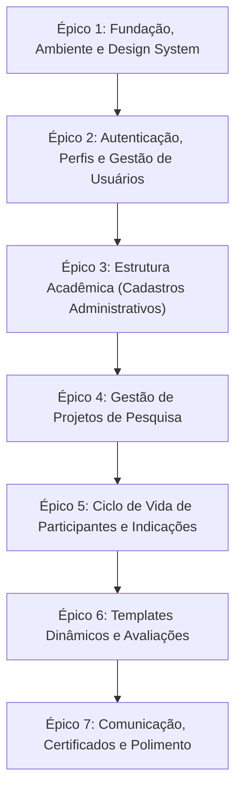

# Roadmap de Desenvolvimento: PINC (Laravel + Vue 3 + Inertia.js)

Este documento é o backlog oficial de desenvolvimento e aprendizado do projeto PINC. Ele está organizado em **Épicos** e **Tarefas Incrementais**, projetados para pair programming guiado.

---

## 🎯 Resumo das Decisões Arquiteturais
* **Metodologia:** Mentoria Guiada (Pair Programming incremental — conceito -> implementação -> revisão).
* **Frontend:** Vue 3 (Composition API / `<script setup>`) + PrimeVue v4 (tema Aura, PrimeIcons) + Tailwind CSS v4.
* **Backend:** Laravel 12 + PHP 8.3+ (tipagem estrita, Enums, FormRequests, Policies, Actions).
* **Banco de Dados:** MySQL / MariaDB local.
* **Autenticação:** Customizada com tabela `usuarios` (CPF), Perfis e Dev Switcher local para troca rápida de papéis.
* **Testes:** Deferidos para a etapa posterior à finalização das funcionalidades.

---

## 🧭 Visão Geral dos Épicos

---

## 📋 Detalhamento dos Épicos e Tarefas

### 🏛️ ÉPICO 1: Fundação, Ambiente e Design System
> **Objetivo:** Estabelecer a base sólida da aplicação, migrar para o PrimeVue v4 (sem avisos de licença), conectar ao banco MariaDB/MySQL e construir o layout mestre da aplicação com navegação e toasts.

- [x] **E1-T1: Downgrade e Estabilização do PrimeVue v4**
  - **Conceitos:** Gerenciamento de dependências npm, CSS de temas, plugin Vue.
  - **Ação:** Instalar `primevue@^4` e `@primevue/themes@^4`, configurar no `app.js` com o preset Aura e remover o banner de licença.
- [x] **E1-T2: Configuração do Banco de Dados MySQL / MariaDB**
  - **Conceitos:** Variáveis de ambiente (`.env`), driver PDO, migrations iniciais.
  - **Ação:** Ajustar as credenciais do MySQL/MariaDB no `.env`, criar o banco de dados e rodar `php artisan migrate`.
- [x] **E1-T3: Instalação e Configuração dos PrimeIcons**
  - **Conceitos:** Pacotes de ícones, importação global no CSS/JS.
  - **Ação:** Instalar `primeicons` e importar em `resources/css/app.css` ou `app.js` para uso nos botões e menus.
- [x] **E1-T4: Criação do Layout Mestre (`AppLayout.vue`)**
  - **Conceitos:** Layouts no Inertia, Slots Vue, componentes de navegação (TopBar, Sidebar responsiva).
  - **Ação:** Construir o layout padrão do sistema com menu lateral/superior, área para dados do usuário logado e área principal para páginas.
  - **commit:** feat: Adicionado Menu principal e utilização de slot do vue
- [x] **E1-T5: Sistema Global de Notificações (Flash Messages & Toast)**
  - **Conceitos:** Inertia Shared Props (HandleInertiaRequests middleware), PrimeVue ToastService.
  - **Ação:** Configurar `Toast` do PrimeVue no `AppLayout.vue` e exibir mensagens de sucesso/erro vindas do backend (`session()->flash('success', ...)`).
  - **Commit** feat: adicionado Toast e compartilhamento de mensagem entre endpoints com Middleware  HandleInertiaRequests

---

### 👤 ÉPICO 2: Autenticação, Perfis e Gestão de Usuários
> **Objetivo:** Implementar o domínio de usuários conforme o PINC, com suporte a múltiplos perfis (Root, Admin, Docente, Discente, Técnico), login local e seletor rápido para mentoria.

- [x] **E2-T1: Modelagem da Tabela de Perfis e Enum Tipado**
  - **Conceitos:** PHP Enums tipados, migrations com foreign keys, seeders idempotentes.
  - **Ação:** Criar Enum `PerfilEnum` (Root=1, Administrador=2, Docente=3, Discente=4, Técnico=5), migration da tabela `perfis` e seeder.
  - **commit** Criação de Enum, Migration, Model e Seeder para Perfil
- [x] **E2-T2: Modelagem da Tabela `usuarios` e Tabela Pivô `perfil_usuario`**
  - **Conceitos:** Custom User Model no Laravel (`auth.php`), mutators/casts de CPF, soft deletes, relacionamento `belongsToMany`.
  - **Ação:** Criar migration e Model `Usuario` (campos: cpf, nome, nome_social, email, telefone, lattes, siape, sira, situacao) conectado a `perfis`.
- [x] **E2-T3: Modelagem Complementar: Tabela `alunos` e `log_users`**
  - **Conceitos:** Relacionamento `hasOne`, registros de auditoria de login.
  - **Ação:** Criar migrations e Models `Aluno` (curso importado) e `LogUser` (registro de acessos).
- [x] **E2-T4: Seeder de Usuários de Demonstração para Cada Perfil**
  - **Conceitos:** Database Seeders, Factories, criptografia de senhas (Hash::make).
  - **Ação:** Criar `UsuarioSeeder` gerando contas pré-definidas para cada perfil para uso em desenvolvimento.
- [x] **E2-T5: Sistema de Login Tradicional e Dev Switcher (Troca Rápida)**
  - **Conceitos:** Autenticação Laravel (`Auth::guard()`), Controllers Inertia, Dev Tooling condicionado a `app()->isLocal()`.
  - **Ação:** Criar tela de login por CPF/senha e componente visual flutuante para logar com 1 clique em qualquer perfil durante os testes.
- [ ] **E2-T6: Funcionalidade de Impersonation (Root assumindo outro usuário)**
  - **Conceitos:** Sessões no Laravel, middleware de personificação, banner de aviso no topo.
  - **Ação:** Permitir que o Root assuma a identidade de qualquer usuário e possa "voltar" ao perfil original a qualquer momento.
- [ ] **E2-T7: Tela "Meu Perfil" (Dados Pessoais)**
  - **Conceitos:** FormRequests, validação de Lattes e telefone, Inertia Form helper (`useForm`).
  - **Ação:** Página onde o usuário visualiza seus dados acadêmicos e atualiza telefone e link do Lattes.
- [ ] **E2-T8: Gestão Administrativa de Usuários (Root / Admin)**
  - **Conceitos:** PrimeVue DataTable com paginação remota, filtros de busca por nome/CPF/perfil e modal de edição de perfis.
  - **Ação:** Criar listagem e edição de usuários para a administração.

---

### 📚 ÉPICO 3: Estrutura Acadêmica (Cadastros Administrativos)
> **Objetivo:** Cadastrar e gerenciar toda a árvore institucional: Campus, Cursos, Departamentos/Laboratórios, Disciplinas (PINCs) e Agências de Fomento, com regras estritas de proteção contra exclusão.

- [ ] **E3-T1: Modelagem e Seeders da Estrutura Acadêmica**
  - **Conceitos:** Chaves estrangeiras em cascata ou restritivas, relacionamentos em árvore (`Campus -> Curso -> Departamento`).
  - **Ação:** Criar migrations e models para `Campus`, `Curso`, `Departamento`, `Disciplina` (PINC 1 a 4) e `Agencia`.
- [ ] **E3-T2: CRUD Administrativo de Campus**
  - **Conceitos:** Resource Controllers, FormRequests, PrimeVue Dialog com formulário reativo.
  - **Ação:** Criar listagem, criação, edição e exclusão (com validação de dependências: bloquear se houver cursos vinculados).
- [ ] **E3-T3: CRUD Administrativo de Cursos**
  - **Conceitos:** Dropdowns reativos (selecionar Campus), validação de e-mail institucional e flag `colaborador`.
  - **Ação:** Tela administrativa de cursos vinculados aos campi.
- [ ] **E3-T4: CRUD Administrativo de Departamentos / Laboratórios**
  - **Conceitos:** Regra de unicidade composta (`unique:departamentos,nome,NULL,id,curso_id`), filtros por curso.
  - **Ação:** Gerenciamento dos departamentos subordinados a cursos.
- [ ] **E3-T5: CRUD Administrativo de Disciplinas / Períodos (PINC)**
  - **Conceitos:** Bloqueio de exclusão quando associada a avaliações, listagem ordenada.
  - **Ação:** Cadastro e manutenção das disciplinas do programa.
- [ ] **E3-T6: CRUD Administrativo de Agências de Fomento**
  - **Conceitos:** Enum `AgenciaTipoEnum` (1: bolsista, 2: projeto, 3: ambos), registro especial "Sem Bolsa".
  - **Ação:** Cadastro de agências de fomento financeiro.

---

### 🔬 ÉPICO 4: Gestão de Projetos de Pesquisa
> **Objetivo:** Implementar o cadastro, ciclo de vida e visualização pública e autenticada dos projetos de iniciação científica.

- [ ] **E4-T1: Modelagem da Tabela `projetos` e Relacionamento do Responsável**
  - **Conceitos:** Relacionamento `belongsTo(Usuario::class, 'responsavel_id')`, soft deletes, escopos (`scopeAtivos`, `scopeArquivados`).
  - **Ação:** Migration e Model `Projeto` com campos: titulo, assunto, descricao, vagas, arquivado, departamento_id, responsavel_id, agencia_id.
- [ ] **E4-T2: Regras de Negócio de Criação de Projeto (Docente + Lattes)**
  - **Conceitos:** Laravel Policies (`create`), validação de perfil docente e presença de Lattes preenchido.
  - **Ação:** Implementar regra que impede usuários sem Lattes ou não-docentes de criar projetos.
- [ ] **E4-T3: Formulário de Cadastro e Edição de Projetos**
  - **Conceitos:** Dropdown dinâmico encadeado (seleciona Curso -> carrega Departamentos), validação de vagas (`>= 0`).
  - **Ação:** Tela de cadastro com validações em tempo real via Inertia.
- [ ] **E4-T4: Associação Automática do Docente Responsável como Participante**
  - **Conceitos:** Laravel Model Observers ou Domain Action (`CreateProjectAction`), transações de banco (`DB::transaction`).
  - **Ação:** Ao salvar o projeto, inserir automaticamente o responsável na tabela de participantes como ativo.
- [ ] **E4-T5: Catálogo Público de Projetos (Home)**
  - **Conceitos:** Filtros por query params (`preserveState: true`), busca textual por título/assunto, paginação do Eloquent.
  - **Ação:** Construir a página inicial aberta com cards/tabela de projetos e modal com resumo detalhado.
- [ ] **E4-T6: Listagem Autenticada de Projetos (Meus Projetos vs Todos os Projetos)**
  - **Conceitos:** Autorização por perfil: docentes/técnicos veem os seus; administradores veem todos com busca.
  - **Ação:** Páginas de projetos ativos e aba de projetos arquivados.
- [ ] **E4-T7: Arquivamento e Regra de Capacidade de Vagas**
  - **Conceitos:** Regra que impede diminuir vagas abaixo do número de discentes ativos; arquivamento movendo participantes para histórico.
  - **Ação:** Implementar endpoint e interface para arquivar projeto e editar vagas com trava de segurança.

---

### 🤝 ÉPICO 5: Ciclo de Vida de Participantes e Indicações
> **Objetivo:** Criar a máquina de estados que controla a entrada, permanência, saída e histórico de participantes e discentes no projeto.

- [ ] **E5-T1: Modelagem da Pivô `projeto_usuario` e Enum de Status**
  - **Conceitos:** Enum `ParticipanteStatusEnum` (0: Ativo, 1: Entrando, 2: Saindo, 3: Histórico), timestamps de auditoria.
  - **Ação:** Migration com índice composto (`projeto_id`, `usuario_id`, `flags`) e relacionamento `belongsToMany` com `withPivot`.
- [ ] **E5-T2: Tela de Detalhes do Projeto com Acordeões de Participantes**
  - **Conceitos:** PrimeVue Accordion / Tabs, badges de status, botões de ação contextuais por permissão.
  - **Ação:** Construir página detalhada exibindo: Docentes, Técnicos, Discentes Ativos, Indicados (Aguardando Aceite) e Histórico.
- [ ] **E5-T3: Service de Transição de Estados (`ProjetoParticipanteService`)**
  - **Conceitos:** Domain Services, lock de linha ou validação estrita de vagas disponíveis, integridade transacional.
  - **Ação:** Centralizar regras: `indicar()`, `aceitar()`, `rejeitar()`, `indicarSaida()`, `removerParaHistorico()`, `manter()`.
- [ ] **E5-T4: Fluxo de Indicação de Discente por Docente/Técnico**
  - **Conceitos:** Modal de busca por CPF/e-mail, verificação se o usuário tem perfil Discente e se há vaga livre.
  - **Ação:** Endpoint e formulário para indicar discente (colocando o status em `Entrando`).
- [ ] **E5-T5: Aceite e Rejeição de Indicações (com Geração Automática de Avaliação)**
  - **Conceitos:** Event-Driven ou chamada direta: ao aceitar, muda para `Ativo` e dispara a criação da `Avaliacao`.
  - **Ação:** Botões de Aceitar/Rejeitar disponíveis para o responsável pelo projeto.
- [ ] **E5-T6: Fluxo de Saída de Discente (Indicar Saída, Manter ou Mover para Histórico)**
  - **Conceitos:** Transição de estados reversível (`Saindo` -> `Manter`) ou definitiva (`Saindo` -> `Histórico`).
  - **Ação:** Ações na interface para desligar participante liberando a vaga.

---

### 📝 ÉPICO 6: Templates Dinâmicos e Avaliações
> **Objetivo:** O coração pedagógico do PINC: relatórios dinâmicos configuráveis por curso, submissão de relatório final pelo aluno com anexos, avaliação de desempenho pelo docente e aprovação administrativa.

- [ ] **E6-T1: Modelagem de Templates de Relatório (`relatorios`) e Avaliações (`avaliacoes`)**
  - **Conceitos:** JSON columns no MySQL/Eloquent, casts tipados (`AsArrayObject` ou custom cast).
  - **Ação:** Criar migrations para `relatorios` (curso_id, rel_final JSON, rel_desempenho JSON) e `avaliacoes`.
- [ ] **E6-T2: Seeder de Templates Padrão de Relatório para Cursos**
  - **Conceitos:** Esquema do formulário JSON (campos: nome, tipo [texto, textarea, select, number, soma], tamanho, obrigatorio).
  - **Ação:** Popular templates realistas para os cursos existentes.
- [ ] **E6-T3: Motor do Formulário Dinâmico em Vue 3 (`DynamicReportForm.vue`)**
  - **Conceitos:** Componentes dinâmicos Vue (`<component :is="...">`), `v-model` reativo em árvores de dados JSON, campos calculados (soma).
  - **Ação:** Componente que lê o JSON do template e renderiza os campos correspondentes com validações visuais.
- [ ] **E6-T4: Preenchimento do Relatório Final pelo Discente (Rascunho vs Envio)**
  - **Conceitos:** Políticas de autorização (apenas o aluno dono pode editar), validação de campos obrigatórios apenas no envio definitivo.
  - **Ação:** Interface onde o aluno responde as perguntas do projeto e pode salvar rascunho ou submeter definitivamente.
- [ ] **E6-T5: Gerenciamento de Anexos e Documentos da Avaliação**
  - **Conceitos:** Laravel Storage, validação de arquivos (PDF/imagens, tamanho máximo), download seguro e exclusão.
  - **Ação:** Componente de upload com legenda para anexar documentos científicos ao relatório.
- [ ] **E6-T6: Avaliação de Desempenho pelo Responsável do Projeto**
  - **Conceitos:** Formulário dinâmico do responsável com notas, conceitos ou parecer sobre o bolsista.
  - **Ação:** Tela para o docente avaliar o aluno participante.
- [ ] **E6-T7: Tela de Avaliação e Julgamento Administrativo**
  - **Conceitos:** Atualização de metadados (Agência, Disciplina/PINC, Vínculo, Semestre/Ano) e resultado final (Aprovado, Reprovado, Excluído).
  - **Ação:** Tela onde a coordenação/responsável bate o martelo sobre a aprovação e data de avaliação.
- [ ] **E6-T8: Listagem de Avaliações em Andamento e Finalizadas**
  - **Conceitos:** PrimeVue DataTable com filtros avançados por Curso, Projeto, Aluno e Status de Envio.
  - **Ação:** Painéis de consulta para discentes, docentes e administração.

---

### 🚀 ÉPICO 7: Comunicação, Certificados e Polimento
> **Objetivo:** Completar o ciclo institucional com emissão fake de certificados, filas assíncronas para e-mails e páginas públicas de contato e erro.

- [ ] **E7-T1: Emissão de Certificados (`FakeCertificateService`)**
  - **Conceitos:** Service Pattern, Interfaces PHP, geração de hash UUID, bloqueio de reemissão.
  - **Ação:** Endpoint administrativo para gerar certificados em lote para avaliações aprovadas e salvar `certificado_hash`.
- [ ] **E7-T2: Página Pública de Consulta e Validação de Certificado**
  - **Conceitos:** Consulta aberta por código hash, exibição dos dados oficiais da participação.
  - **Ação:** Rota pública `/certificados/{hash}` validando a autenticidade do certificado emitido.
- [ ] **E7-T3: Fila de E-mails e Notificações (Contato e Mensagens em Massa)**
  - **Conceitos:** Laravel Queues (`database`), Mailable classes, respeitar campo `desabilitar_email`.
  - **Ação:** Envio em background de e-mail de contato público e disparo administrativo segmentado por curso/campus.
- [ ] **E7-T4: Exportação Administrativa de Dados (XLSX / CSV)**
  - **Conceitos:** Exportação de relatórios de alunos aprovados/reprovados e dados cadastrais.
  - **Ação:** Botões de exportação na área administrativa.
- [ ] **E7-T5: Telas de Erro Customizadas (401, 403, 404, 503)**
  - **Conceitos:** Inertia Error Handling, páginas de erro amigáveis e acessíveis com retorno à Home.
  - **Ação:** Componentes Vue em `resources/js/pages/Errors/`.

---

## 🏁 Como Vamos Trabalhar em Cada Tarefa (Ciclo de Mentoria)

Para cada tarefa, seguiremos o fluxo:
1. **Briefing & Arquitetura:** Eu explico os conceitos teóricos do Laravel / Vue / Inertia envolvidos e os arquivos que serão tocados.
2. **Implementação Guiada:** Você escreve o código (ou eu te forneço a base para você completar e adaptar).
3. **Verificação & Code Review:** Testamos a tela/funcionalidade no navegador, revisamos o código e marcamos o checklist `[x]` aqui no documento!
