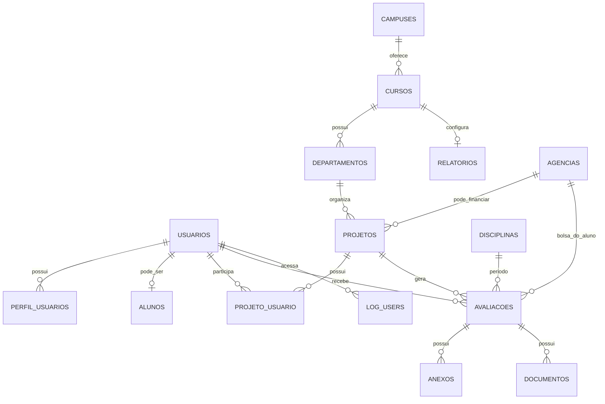

# Guia de recriação do PINC com Laravel, Vue 3 e InertiaJS

## 1. Objetivo

Este documento descreve uma recriação didática do **PINC — Programa de Iniciação Científica de Ciências Biomédicas da UFRJ**. A aplicação gerencia projetos de iniciação científica, participantes, avaliações, relatórios e certificados.

O objetivo é reproduzir o domínio e os fluxos mais importantes usando:

- Laravel para rotas, autenticação, regras de negócio, persistência e filas;
- Vue 3 para os componentes de interface;
- InertiaJS para navegar entre páginas Laravel e componentes Vue sem criar uma API REST completa;
- MariaDB ou MySQL;
- armazenamento local ou S3 para anexos e relatórios;
- filas para e-mails e integrações demoradas.

> Este guia foi elaborado a partir da estrutura, modelos, controllers, rotas, views, componentes Vue e schema SQL presentes nesta aplicação. Nomes de tabelas e campos abaixo preservam, quando útil, o domínio original. Para uma aplicação nova, também são sugeridas algumas melhorias de modelagem.

## 2. Visão do negócio

O sistema permite que a coordenação do programa:

1. cadastre a estrutura acadêmica: campus, cursos, departamentos/laboratórios e disciplinas/períodos;
2. cadastre agências de fomento;
3. acompanhe projetos de pesquisa e suas vagas;
4. associe docentes, técnicos e discentes a cada projeto;
5. controle indicações, entradas, saídas e histórico de participantes;
6. acompanhe o relatório final do discente e a avaliação de desempenho feita pelo responsável;
7. aprove, reprove ou exclua uma avaliação;
8. gere relatórios administrativos e envie certificados para um serviço externo.

## 3. Perfis e permissões

| Perfil | Responsabilidade principal |
|---|---|
| Root | Administração técnica; gerencia usuários, pode assumir o papel de outro usuário e consultar/limpar logs. |
| Administrador | Administração do programa/faculdade; gerencia cadastros, usuários, relatórios, e-mails e certificados. |
| Docente | Responsável por projetos; gerencia colaboradores e discentes, avalia desempenho e aprova avaliações. |
| Técnico | Colaborador de projeto; pode consultar projetos e indicar discentes, conforme a regra do sistema. |
| Discente | Participante; consulta projetos, preenche dados pessoais e envia seu relatório final. |

Regras de acesso que devem existir no projeto novo:

- páginas administrativas: apenas `root` ou `administrador`;
- criação de projeto: docente com Lattes preenchido;
- edição de projeto: responsável pelo projeto, root ou administrador;
- edição de dados pessoais: o próprio usuário; root e administrador podem editar usuários;
- edição do relatório final: o discente dono da avaliação, root ou administrador;
- edição do relatório de desempenho: responsável pelo projeto, root ou administrador;
- aprovação: responsável pelo projeto, root ou administrador;
- indicação, aceitação, rejeição e movimentação de participantes: aplicar Policy por projeto e por ação;
- root pode assumir temporariamente o papel de outro usuário, registrando claramente esse estado na sessão.

No Laravel, prefira `Policies` e `Gate` em vez de espalhar verificações como `if ($usuario->is_admin)` pelos controllers.

## 4. Modelo de dados

### 4.1 Diagrama conceitual



### 4.2 Tabelas de negócio

As tabelas abaixo representam o schema existente. Os campos `created_at` e `updated_at` são omitidos quando forem apenas timestamps padrão.

#### `usuarios`

Cadastro central de pessoas autenticadas pelo CAS ou criadas para uma indicação.

| Campo | Tipo/regra | Observação |
|---|---|---|
| `id` | bigint unsigned, PK | Identificador interno. |
| `cpf` | varchar(11), unique, obrigatório | Identidade usada na integração com o CAS. Armazene somente números. |
| `nome` | varchar(200), nullable | Nome sincronizado com o CAS. |
| `nome_social` | varchar(200), nullable | Nome de tratamento. |
| `email` | varchar(255), unique, nullable | E-mail institucional ou informado para colaborador externo. |
| `telefone` | varchar(15), nullable | Editável pelo usuário. |
| `lattes` | varchar(200), nullable | ID do currículo Lattes. Obrigatório para docente criar projeto. |
| `siape` | integer, nullable | Matrícula de servidor. |
| `sira` | integer, nullable | Registro de discente. |
| `situacao` | boolean, default `true` | Usuário ativo/inativo. |
| `desabilitar_email` | boolean, nullable | Opt-out de comunicações em massa. |
| `deleted_at` | timestamp, nullable | Soft delete herdado do sistema. |

#### `perfil_usuarios`

Relaciona usuários aos perfis. O sistema original usa `perfil_id` como constante e não possui uma tabela `perfis`.

| Campo | Tipo/regra |
|---|---|
| `id` | PK |
| `usuario_id` | FK para `usuarios.id` |
| `perfil_id` | inteiro: 1 Root, 2 Administrador, 3 Docente, 4 Discente, 5 Técnico |

Para aprender Laravel, é melhor criar também uma tabela `perfis` ou usar um enum bem documentado. Se houver tabela, adicione uma unique composta em (`usuario_id`, `perfil_id`).

#### `alunos`

Dados acadêmicos complementares do discente.

| Campo | Tipo/regra |
|---|---|
| `id` | PK |
| `usuario_id` | FK para `usuarios.id` |
| `curso` | varchar(45) | Curso importado do SIGA. |

O usuário pode possuir no máximo um registro em `alunos`. No sistema original, a importação busca o curso do aluno por CPF em um serviço externo.

#### `campuses`

| Campo | Tipo/regra |
|---|---|
| `id` | PK |
| `nome` | varchar(100), obrigatório |
| `deleted_at` | timestamp, nullable |

Um campus possui muitos cursos. O nome deve ser único entre registros ativos.

#### `cursos`

| Campo | Tipo/regra | Observação |
|---|---|---|
| `id` | PK | |
| `nome` | varchar(100), obrigatório | Pode existir o mesmo nome em campi diferentes. |
| `campus_id` | FK para `campuses.id` | |
| `documento_id` | inteiro, nullable | Tipo/documento usado na emissão de certificado externo. |
| `email` | varchar(255), nullable | E-mail de contato do curso. |
| `disciplina_id` | FK para `disciplinas.id`, nullable | Limite de disciplina/período usado na avaliação. |
| `colaborador` | boolean, nullable | Indica se o certificado menciona colaborador. |
| `deleted_at` | timestamp, nullable | |

Um curso possui departamentos, um relatório configurável e uma disciplina/período de referência.

#### `departamentos`

| Campo | Tipo/regra |
|---|---|
| `id` | PK |
| `nome` | varchar(100), obrigatório |
| `curso_id` | FK para `cursos.id` |
| `deleted_at` | timestamp, nullable |

O par (`curso_id`, `nome`) deve ser único entre registros ativos. No domínio, departamento também representa laboratório.

#### `disciplinas`

Representa os períodos do programa, como PINC 1, PINC 2 etc.

| Campo | Tipo/regra |
|---|---|
| `id` | PK |
| `nome` | varchar(10), obrigatório e único |
| `deleted_at` | timestamp, nullable |

Não permita exclusão quando houver avaliações vinculadas.

#### `agencias`

| Campo | Tipo/regra |
|---|---|
| `id` | PK |
| `sigla` | varchar(20), obrigatório |
| `nome` | varchar(255), obrigatório |
| `tipo` | smallint, nullable: 1 bolsista, 2 projeto, 3 ambos |
| `deleted_at` | timestamp, nullable |

O par `nome`/`sigla` não deve se repetir. A agência `Sem bolsa` é tratada como uma opção válida na avaliação, pois a aprovação exige uma escolha explícita.

#### `projetos`

| Campo | Tipo/regra | Observação |
|---|---|---|
| `id` | PK | |
| `titulo` | varchar(300), obrigatório | |
| `assunto` | varchar(500), obrigatório | |
| `descricao` | text, obrigatório | |
| `vagas` | inteiro, obrigatório, `>= 0` | Quantidade total de discentes ativos. |
| `arquivado` | boolean, nullable | `null` = ativo; `true` = arquivado na implementação original. |
| `departamento_id` | FK para `departamentos.id` | |
| `responsavel_id` | FK para `usuarios.id` | Deve apontar para um docente. |
| `agencia_id` | FK para `agencias.id`, nullable | Agência associada ao projeto, diferente da agência da bolsa do discente. |

Ao criar o projeto, o responsável é automaticamente incluído em `projeto_usuario` como participante ativo.

#### `projeto_usuario`

É a tabela pivô entre projeto e usuário e também guarda o histórico do vínculo.

| Campo | Tipo/regra |
|---|---|
| `id` | PK |
| `projeto_id` | FK para `projetos.id` |
| `usuario_id` | FK para `usuarios.id` |
| `flags` | smallint: 0 ativo, 1 entrando, 2 saindo, 3 histórico |
| `created_at`/`updated_at` | timestamps | Permitem exibir o período do vínculo. |

Crie um índice em (`projeto_id`, `usuario_id`, `flags`). O vínculo deve ser único por projeto e usuário; alterações de status devem atualizar a mesma linha em vez de criar duplicatas.

#### `avaliacaos`

Uma avaliação representa a participação de um discente em um projeto. O nome da tabela é legado; em um projeto novo, `avaliacoes` é mais idiomático.

| Campo | Tipo/regra | Observação |
|---|---|---|
| `id` | PK | |
| `projeto_id` | FK | |
| `usuario_id` | FK | Discente avaliado. |
| `agencia_id` | FK, nullable | Agência da bolsa ou `Sem bolsa`. |
| `disciplina_id` | FK, nullable | PINC/período. |
| `vinculo_id` | smallint, nullable | 1 IC, 2 Mestrado, 3 Doutorado. |
| `ano` | smallint, nullable | Ano do semestre. |
| `semestre` | smallint, nullable | 1 ou 2. |
| `aprovado` | boolean/smallint, nullable | `null` em aberto, 0 reprovado, 1 aprovado, 2 excluído. |
| `data_avaliacao` | date, nullable | Data da decisão. |
| `rel_final_enviado` | boolean, nullable | Relatório final submetido. |
| `rel_desempenho_enviado` | boolean, nullable | Avaliação do responsável submetida. |
| `relatorio_final` | varchar(255), nullable | Arquivo legado do relatório final, se usado. |
| `relatorio_desempenho` | varchar(255), nullable | Arquivo legado de desempenho, se usado. |
| `rel_final_json` | longtext JSON | Cópia preenchível do template de relatório final. |
| `rel_desempenho_json` | longtext JSON | Cópia preenchível do template de desempenho. |
| `certificado_hash` | varchar(32), nullable | Identificador retornado pela API de certificados. |

Os campos antigos `titulo`, `resumo`, `justificativa`, `introducao`, `objetivos`, `metodos`, `resultados`, `conclusao`, `avaliacao_desempenho`, `avaliacao_relatorio` e `carga_horaria` existem para compatibilidade com versões anteriores. Na recriação, prefira os JSONs estruturados ou uma tabela normalizada de respostas.

#### `relatorios`

Template de formulários por curso.

| Campo | Tipo/regra |
|---|---|
| `id` | PK |
| `curso_id` | FK para `cursos.id`, idealmente unique |
| `rel_final` | JSON |
| `rel_desempenho` | JSON |

Cada item do JSON possui, no mínimo, `nome`, `tipo`, `tamanho` e `campo`. Exemplos de tipos: texto, string, número, seleção, soma.

> O model original menciona um cast chamado `campos`, mas esse campo não aparece no schema SQL atual. Na recriação, remova essa ambiguidade ou crie explicitamente uma coluna `campos`.

#### `anexos` e `documentos`

Ambos pertencem a uma avaliação e armazenam metadados dos arquivos.

| Campo | Tipo/regra |
|---|---|
| `id` | PK |
| `avaliacao_id` | FK para `avaliacaos.id` |
| `legenda` | varchar(200), obrigatório |
| `nome_arquivo` | varchar(255), obrigatório |

Use `Storage` e nunca confie no nome original enviado pelo navegador. Valide extensão, MIME type, tamanho e autorização antes de exibir ou remover o arquivo.

#### `log_users`

Registra acessos/autenticações do usuário.

| Campo | Tipo/regra |
|---|---|
| `id` | PK |
| `usuario_id` | FK para `usuarios.id` |

Também existem tabelas técnicas do Laravel (`jobs`, `failed_jobs`, `migrations` e a tabela legada `users`). Elas não fazem parte do domínio PINC e podem ser recriadas pelos comandos padrão do framework.

### 4.3 Relacionamentos Eloquent esperados

```text
Campus hasMany Curso
Curso belongsTo Campus
Curso hasMany Departamento
Curso hasOne Relatorio
Curso belongsTo Disciplina
Departamento belongsTo Curso
Departamento hasMany Projeto
Projeto belongsTo Departamento
Projeto belongsTo Usuario como responsavel
Projeto belongsTo Agencia
Projeto belongsToMany Usuario com pivot flags
Projeto hasMany Avaliacao
Usuario hasMany PerfilUsuario
Usuario hasOne Aluno
Usuario belongsToMany Projeto com pivot flags
Usuario hasMany Avaliacao
Avaliacao belongsTo Projeto, Usuario, Agencia e Disciplina
Avaliacao hasMany Anexo e Documento
```

No model `Projeto`, nomeie explicitamente a relação do responsável para evitar ambiguidade:

```php
public function responsavel(): BelongsTo
{
    return $this->belongsTo(Usuario::class, 'responsavel_id');
}
```

## 5. Regras de negócio essenciais

### 5.1 Autenticação e sincronização

Na aplicação original, o login usa CAS da UFRJ:

1. o CAS autentica o CPF;
2. o sistema procura o usuário por CPF;
3. nome, nome social, e-mail, SIAPE e SIRA são sincronizados;
4. o curso do aluno pode ser importado do SIGA;
5. um novo usuário recebe o perfil conforme o grupo retornado pelo CAS;
6. usuários inativos não podem prosseguir;
7. o acesso é registrado em `log_users`.

Para estudar localmente, implemente primeiro um login de demonstração com usuários seedados. Depois substitua o driver por CAS. Não coloque tokens, CPFs reais ou credenciais nos seeders versionados.

### 5.2 Criação e ciclo de vida do projeto

- Apenas docente pode ser responsável por projeto.
- O docente precisa ter Lattes preenchido para cadastrar projeto.
- `vagas` não pode ser negativa.
- Ao criar um projeto, o docente responsável entra automaticamente como colaborador ativo.
- Um projeto ativo possui `arquivado = null`; um arquivado possui `arquivado = true`.
- Ao arquivar, todos os vínculos do projeto vão para histórico.
- O projeto não deve permitir novos participantes depois de arquivado.
- Ao editar vagas, o novo limite não pode ser menor que a quantidade de discentes ativos.
- O responsável pode editar seu próprio projeto; root e administrador também.

### 5.3 Participantes e estados do vínculo

Estados da tabela pivô:

| Valor | Nome | Significado |
|---:|---|---|
| 0 | `ativo` | Participa atualmente do projeto. |
| 1 | `entrando` | Discente foi indicado e aguarda aceite do responsável. |
| 2 | `saindo` | Participante foi indicado para sair, mas ainda pode ser mantido. |
| 3 | `historico` | Vínculo encerrado. |

Fluxos:

- docente/técnico pode indicar discente;
- a indicação verifica se o usuário tem perfil discente, se não está duplicado e se há vaga;
- aceite transforma `entrando` em `ativo` e cria uma avaliação;
- rejeição remove a indicação;
- responsável pode indicar um discente ativo para saída;
- `remover` transforma o vínculo em histórico;
- `manter` desfaz a indicação de saída;
- um colaborador histórico não deve ser duplicado; se permitido pelo caso de uso, reative o vínculo existente;
- ao remover um discente com avaliação encerrada, a ação “manter” pode criar uma nova avaliação em aberto para uma nova participação.

Para uma recriação consistente, coloque cada transição em um `ProjetoParticipanteService` e valide capacidade dentro de uma transação.

### 5.4 Avaliações e relatórios

Ao criar uma avaliação:

1. associe projeto e discente;
2. copie os templates do relatório do curso para `rel_final_json` e `rel_desempenho_json`;
3. deixe `aprovado`, semestre, disciplina, vínculo e agência vazios;
4. mantenha a avaliação em aberto enquanto `certificado_hash` for `null`.

Relatório final:

- é preenchido pelo discente;
- pode ser salvo como rascunho;
- para enviar, título e todos os campos obrigatórios devem estar preenchidos;
- pode possuir anexos e documentos;
- o discente só pode editar sua própria avaliação.

Relatório de desempenho:

- é preenchido pelo responsável do projeto ou pela administração;
- pode ser salvo como rascunho;
- para enviar, todos os campos obrigatórios devem estar preenchidos;
- pode conter opções, notas ou soma, conforme o template do curso.

Metadados da avaliação:

- discente pode informar/alterar disciplina, vínculo e semestre enquanto a avaliação estiver aberta;
- responsável ou administração pode definir agência e resultado;
- semestre deve ser armazenado como `ano` e `semestre`, por exemplo `2026` e `1`.

### 5.5 Aprovação e finalização

O resultado pode ser:

- `null`: em andamento;
- `0`: reprovado;
- `1`: aprovado;
- `2`: excluído.

Antes de permitir aprovação, valide:

1. relatório de desempenho submetido ou disponível conforme a política do programa;
2. agência definida, incluindo a opção “Sem bolsa”;
3. dados de período e vínculo preenchidos;
4. usuário e projeto ainda existentes.

Ao avaliar, grave `data_avaliacao`. Avaliações finalizadas são exibidas quando `certificado_hash` não é nulo, mas o resultado também deve ser considerado para relatórios administrativos.

### 5.6 Certificados

O fluxo externo original é:

1. buscar avaliações aprovadas sem certificado;
2. agrupar participantes por curso;
3. montar o payload com CPF, nome, projeto, período, carga horária, orientador e departamento;
4. enviar à API de certificados;
5. salvar o identificador retornado em `certificado_hash`;
6. exibir um link público para consulta do certificado.

Para o treinamento, crie inicialmente um `FakeCertificateService` que retorna um UUID. Só depois implemente o cliente HTTP real, com timeout, retry, logs e variáveis de ambiente.

### 5.7 Cadastros administrativos

Use soft delete nos cadastros. Ao tentar cadastrar novamente um registro apagado, o sistema original o restaura.

Não permita exclusão quando houver dependências:

- campus com cursos;
- curso com departamentos;
- departamento com projetos;
- agência usada em projetos ou avaliações;
- disciplina usada em avaliações.

Implemente as restrições em Policies/Services e também com foreign keys. A regra de negócio não deve depender apenas de `count()` no controller.

### 5.8 Comunicação

Existem dois fluxos de e-mail:

- e-mail de contato público, enviado ao curso e ao remetente;
- e-mail administrativo em massa para discentes ou servidores, filtrado por todos, campus, curso, projeto, projeto ativo ou pessoa individual.

Respeite `desabilitar_email`, elimine duplicatas e envie via fila. Registre o assunto, o alvo e o usuário operador em uma tabela de histórico se quiser evoluir o projeto.

## 6. Telas que devem ser recriadas

### 6.1 Área pública

1. **Página inicial**
   - identidade do PINC;
   - busca/listagem pública de projetos ativos;
   - filtros por título, assunto, campus, curso, departamento e participantes;
   - modal ou drawer com detalhes do projeto.
2. **Sobre e contato**
   - descrição do sistema;
   - lista de e-mails por curso/campus;
   - formulário com campus, curso, nome, e-mail, assunto, mensagem e CAPTCHA.
3. **Login CAS**
   - para o treinamento, tela de login local com seletor de usuário;
   - depois, redirecionamento para CAS.
4. **401, 404 e 503**
   - telas de erro acessíveis e com navegação de retorno.

### 6.2 Área autenticada comum

5. **Dados pessoais**
   - e-mail, nome social, SIAPE/SIRA, curso do discente, telefone, Lattes e perfis;
   - edição de telefone e Lattes;
   - aviso quando root estiver assumindo outro papel.
6. **Projetos ativos**
   - docente/técnico: projetos dos quais participa;
   - discente: projetos dos quais participa;
   - root/admin: todos os projetos, com busca paginada.
7. **Projetos arquivados**
   - mesma estrutura, somente leitura ou ações históricas.
8. **Detalhe do projeto**
   - dados gerais, agência, campus, curso, departamento, vagas e datas;
   - acordeões de docentes, técnicos, discentes, indicados e histórico;
   - ações condicionadas ao perfil e ao papel do usuário.

### 6.3 Área de projetos

9. **Cadastrar projeto**
   - título, assunto, descrição, vagas, campus/curso/departamento, responsável e agência;
   - departamento carregado conforme o curso;
   - validação de Lattes, vagas e responsável docente.
10. **Editar projeto**
    - mesmas informações;
    - impedir redução de vagas abaixo dos discentes ativos.
11. **Adicionar colaborador**
    - tipo docente, técnico ou discente;
    - busca por CPF/e-mail;
    - colaborador interno ou externo;
    - validação de perfil e Lattes para servidor interno.
12. **Indicar discente**
    - CPF, nome e e-mail;
    - estados “aguardando aceite”, “aceitar” e “rejeitar”.

### 6.4 Área de avaliações

13. **Avaliações em andamento**
    - discente vê suas avaliações;
    - docente vê as avaliações de seus projetos;
    - administração consulta por curso e filtro;
    - colunas: projeto, aluno, vínculo, disciplina/período, semestre, relatório final, agência, desempenho e resultado.
14. **Relatório final**
    - formulário dinâmico baseado no template do curso;
    - salvar rascunho ou enviar;
    - anexos e documentos com legenda, upload, visualização e remoção.
15. **Relatório de desempenho**
    - formulário dinâmico para o responsável;
    - campos textuais, seleções, número e soma;
    - salvar ou enviar.
16. **Avaliação administrativa**
    - seleção de agência, disciplina, vínculo e semestre;
    - aprovar, reprovar ou excluir;
    - registrar data e bloquear edição indevida após finalizar.
17. **Avaliações finalizadas**
    - filtro por curso, título e aluno;
    - link para certificado quando existir.

### 6.5 Área administrativa

18. **Usuários**
    - busca por nome, e-mail e CPF;
    - filtro por perfil;
    - edição de dados e perfis;
    - root pode assumir o papel de outro usuário.
19. **Cadastros**
    - CRUD de campus;
    - CRUD de cursos;
    - CRUD de departamentos/laboratórios;
    - CRUD de agências de fomento;
    - CRUD de disciplinas/períodos.
20. **Envio de e-mails**
    - destinatário: discentes ou servidores;
    - filtro por todos, ativos, campus, curso, projeto ou pessoa;
    - assunto e mensagem;
    - confirmação antes do envio.
21. **Relatórios de alunos**
    - aprovados;
    - reprovados/excluídos;
    - visualização tabular e exportação XLSX.
22. **Exportação de usuários**
    - CPF, SIAPE, SIRA, nome, e-mail e perfis.
23. **Exportação de certificados**
    - disparo da integração externa;
    - resultado e quantidade processada.
24. **Logs**
    - somente root;
    - visualização das últimas linhas e limpeza controlada.

## 7. Organização sugerida para Laravel + Inertia

```text
app/
  Actions/
    Projects/CreateProject.php
    Projects/ArchiveProject.php
    Projects/ChangeParticipantStatus.php
    Evaluations/CreateEvaluation.php
    Evaluations/SubmitFinalReport.php
    Evaluations/SubmitPerformanceReport.php
  Enums/
    Profile.php
    ParticipantStatus.php
    EvaluationResult.php
    FundingAgencyType.php
  Http/
    Controllers/
    Requests/
    Resources/
  Models/
  Policies/
  Services/
    CasUserService.php
    SigaStudentService.php
    CertificateService.php
resources/js/
  Layouts/AppLayout.vue
  Components/
    DataTable.vue
    ProjectCard.vue
    DynamicReportForm.vue
    ParticipantStatusBadge.vue
  Pages/
    Public/Home.vue
    Projects/Index.vue
    Projects/Show.vue
    Projects/Create.vue
    Projects/Edit.vue
    Evaluations/Index.vue
    Evaluations/FinalReport.vue
    Evaluations/PerformanceReport.vue
    Admin/Users/Index.vue
    Admin/Catalogs/*.vue
```

Princípios:

- Controllers recebem a requisição, autorizam e delegam;
- `FormRequest` valida entrada;
- `Policy` autoriza a ação;
- `Action` ou `Service` executa uma operação de negócio transacional;
- Resources/DTOs definem os dados enviados ao Vue;
- componentes Vue não devem conhecer SQL nem regras de permissão sensíveis;
- use `Inertia::render('Projects/Show', [...])` para páginas;
- use `router.visit`, `router.post`, `router.put` e `router.delete` no Vue;
- mantenha filtros e paginação na URL para permitir compartilhamento e voltar do navegador.

## 8. Rotas Inertia sugeridas

```text
GET    /                         Public/Home
GET    /sobre                    Public/About
POST   /sobre/contato            Public/Contact.store

GET    /dashboard                Dashboard
GET    /perfil                   Profile/Show
PUT    /perfil                   Profile/Update

GET    /projetos                 Projects/Index
GET    /projetos/arquivados      Projects/Archived
GET    /projetos/criar           Projects/Create
POST   /projetos                 Projects/Store
GET    /projetos/{projeto}       Projects/Show
GET    /projetos/{projeto}/editar Projects/Edit
PUT    /projetos/{projeto}       Projects/Update
POST   /projetos/{projeto}/arquivar Projects/Archive

POST   /projetos/{projeto}/participantes      Participants/Store
POST   /projetos/{projeto}/indicacoes         Participants/Indicate
POST   /participacoes/{participacao}/aceitar  Participants/Accept
POST   /participacoes/{participacao}/rejeitar Participants/Reject
POST   /participacoes/{participacao}/historico Participants/Remove
POST   /participacoes/{participacao}/manter    Participants/Keep

GET    /avaliacoes               Evaluations/Index
GET    /avaliacoes/finalizadas   Evaluations/Finished
GET    /avaliacoes/{avaliacao}/relatorio-final       Evaluations/FinalReport
PUT    /avaliacoes/{avaliacao}/relatorio-final       Evaluations/FinalReport.update
GET    /avaliacoes/{avaliacao}/desempenho             Evaluations/PerformanceReport
PUT    /avaliacoes/{avaliacao}/desempenho             Evaluations/PerformanceReport.update
POST   /avaliacoes/{avaliacao}/resultado              Evaluations/Result.store

Route::prefix('admin')->middleware('can:manage-admin')->group(...)
```

## 9. Plano de implementação por etapas

### Etapa 1 — Base do projeto

- criar Laravel com Inertia, Vue 3, Vite e Tailwind ou outro design system;
- configurar banco, storage, filas e e-mail local;
- criar layout, menu, flash messages, erros e paginação;
- implementar usuários seedados e login local.

### Etapa 2 — Estrutura acadêmica

- migrations e models de campus, curso, departamento e disciplina;
- CRUD administrativo;
- Policies;
- validações de unicidade e proteção contra exclusão com dependência.

### Etapa 3 — Usuários e perfis

- usuários, perfis e aluno;
- tela de dados pessoais;
- filtro, paginação e edição administrativa;
- seeders sem dados pessoais reais.

### Etapa 4 — Projetos e participantes

- criação, edição, listagem e arquivamento;
- detalhe do projeto;
- pivot de participantes e máquina de estados;
- indicações, aceite, rejeição e histórico;
- testes de capacidade e autorização.

### Etapa 5 — Avaliações

- avaliação criada automaticamente para discente ativo;
- template de relatório por curso;
- formulário Vue dinâmico;
- rascunho, envio, anexos e documentos;
- avaliação de desempenho e resultado.

### Etapa 6 — Administração e integrações

- relatórios XLSX;
- envio de e-mails em fila;
- serviço fake de certificados;
- integração SIGA e CAS apenas após o domínio local estar estável;
- logs e observabilidade.

## 10. Testes indispensáveis

Crie testes de feature para, pelo menos:

- usuário sem permissão receber 403;
- docente sem Lattes não conseguir criar projeto;
- projeto não aceitar vagas negativas;
- projeto não aceitar redução abaixo de discentes ativos;
- responsável ser incluído automaticamente como participante;
- indicação duplicada ser rejeitada;
- aceite criar exatamente uma avaliação;
- rejeição remover somente a indicação;
- arquivamento mover participantes para histórico;
- aluno editar apenas a própria avaliação;
- todos os campos obrigatórios serem exigidos ao enviar relatório;
- relatório salvo como rascunho não aparecer como enviado;
- avaliação só ser aprovada quando os pré-requisitos estiverem completos;
- arquivo inválido ou acesso indevido ser recusado;
- exclusão de campus/curso/departamento/agência/disciplina com dependências ser bloqueada;
- e-mail não ser enviado para quem optou por `desabilitar_email`.

## 11. Decisões recomendadas para a versão de treino

Para aprender com menos complexidade, implemente primeiro:

- autenticação local, deixando CAS para uma etapa posterior;
- uma tabela `roles` normalizada em vez de números mágicos;
- `participantes_projeto` com um enum de status;
- uma tabela `respostas_avaliacao` se quiser exercitar relacionamentos, ou JSON se quiser focar em Inertia/Vue;
- um serviço fake de certificados;
- upload local com `Storage::fake()` nos testes;
- autorização via Policies e autorização por ação;
- transações para aceitar, remover e arquivar participantes;
- componentes reutilizáveis de tabela, formulário, modal e feedback.

O importante é preservar os fluxos do domínio: **projeto → participante → avaliação → relatórios → resultado → certificado**.

